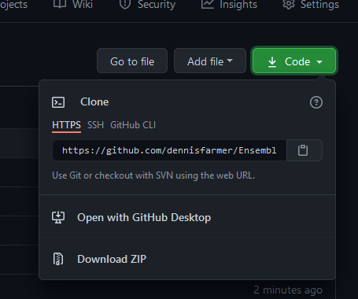
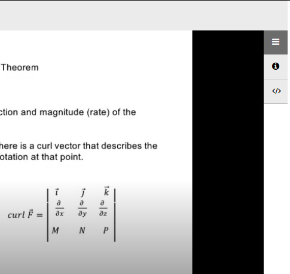

# Ensemblevideo Link Converter 

[](https://raw.githubusercontent.com/dennisfarmer/Ensemble-Video-Downloader/master/LICENSE)

Wanting to save lecture videos hosted on ensemblevideo to your computer? Use this simple program to convert `ensemblevideo.com` links to ones that contain a download button! Supports both `schoolname.ensemblevideo` and `cloud.ensemblevideo` links.

### Installation on Windows 10:

- Install Python 3.9 from the Windows Store
- Click "Download ZIP" from the code menu on this github page:

- Extract the files in the ZIP folder
- Run `install.py` with Python 3.9 (to install requirements, first time only)

### Running the Application:
- Run `app.py` with Python 3.9
- Paste the url to the EnsembleVideo video in the large textbox
- Click "Convert Link" to change the url to one which contains a url
- Copy the new url and open it in a web browser
- Click the download icon in the upper right corner to save the video to your computer

#### Before (yucky):
```
https://washtenaw.ensemblevideo.com/hapi/v1/contents/d5cedd1f-a75c-449f-8000-e4f16773d456/launch?idn_playlist=ec4d8686-acfc-44d5-b689-a9ec72a1abc0&idn_init=False&idn_sig=prmGHSxKawTxeGmNOdXKdOX1LGA%3D&?displayTitle=true&startTime=0&autoPlay=true&hideControls=False&showCaptions=False&displaySharing=False&displayAnnotations=True&displayAttachments=True&displayLinks=True&displayDownloadIcon=False&displayMetaData=true&displayEmbedCode=True&audioPreviewImage=False&displayCaptionSearch=True&displayViewersReport=False&displayAxdxs=False&forceDisplayAdsOff=False&embedAsThumbnail=False&playlistId=&displayCredits=False&isJavaScriptEmbed=False&isContentPreview=False&isResponsive=False&useFourByThreeRatio=False&isJavascriptInIframe=False
```


#### After (less yucky):
```
https://washtenaw.ensemblevideo.com/hapi/v1/contents/d5cedd1f-a75c-449f-8000-e4f16773d456/launch?&displayDownloadIcon=True
```


